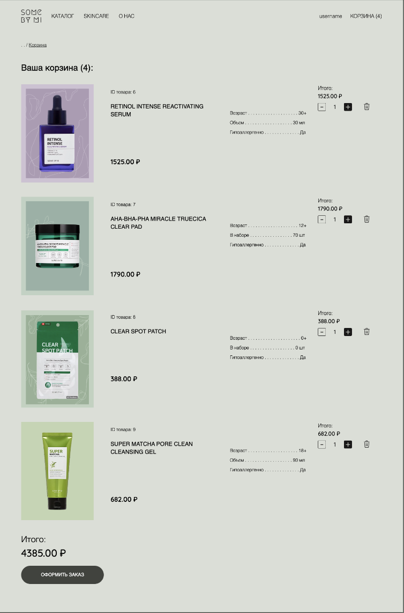

# Сайт для онлайн-магазина косметики

Создан с помощью Node.js, использовались EJS, фреймворки Bootstrap и Tailwind CSS.

## Инструкция к запуску
1. Скачать репозиторий;
2. Скачать зависимости через npm install;
3. Создать базу данных в MySQL;
4. Импортировать дамп базы данных через mysql -u [user] -p cosmetic_shop < cosmetic_shop_dump.sql;
5. Заполнить .env (пример в .env.example);
6. Запустить через npm run dev.

Логин и пароль от изначального администратора в файле initAdmin.js (вход по логину производится через почту).

## Скриншоты сайта:

#### Главная страница

#### Каталог товаров

#### Страница товара

#### Страница «Skincare»

#### Страница «О нас»

#### Попап авторизации

#### Попап регистрации

#### Профиль пользователя

#### Редактирование профиля пользователя

#### Заказы пользователя

#### Корзина

